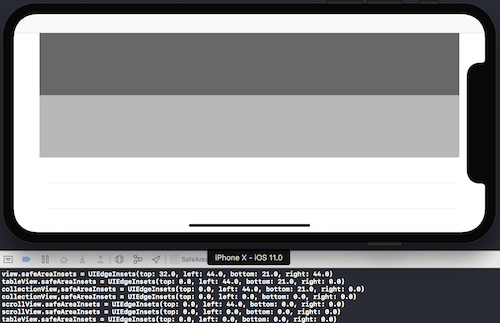

# SafeAreaExtension

[](https://travis-ci.org/marty-suzuki/SafeAreaExtension)
[](http://cocoapods.org/pods/SafeAreaExtension)
[](http://cocoapods.org/pods/SafeAreaExtension)
[](http://cocoapods.org/pods/SafeAreaExtension)
[](https://github.com/Carthage/Carthage)

You can handle safeAreaInsets changes of every UIView.



## Usage

```swift
final class ViewController: UIViewController {

    override func viewDidLoad() {
        super.viewDidLoad()

        view.safeArea.insetsDidChange = { insets in
            // If safeAreaInsets of `self.view`, this closure called.
            print("view.safeAreaInsets = \(insets)")
        }
    }
}
```

### UIView Extension

```swift
extension UIView {
    // UIView Extension about Safe Area
    var safeArea: SafeAreaExtension { get }
}

class SafeAreaExtension {
    // Safe Area Insets handler
    var insetsDidChange: ((UIEdgeInsets) -> ())? { get set }
}
```

## Requirements

- Xcode 9 or greater
- Swift 4 or greater
- iOS 11 or greater

## Installation

### CocoaPods

SafeAreaExtension is available through [CocoaPods](http://cocoapods.org). To install
it, simply add the following line to your Podfile:

```ruby
pod 'SafeAreaExtension'
```

### Carthage

If you’re using [Carthage](https://github.com/Carthage/Carthage), simply add
SafeAreaExtension to your `Cartfile`:

```ruby
github "marty-suzuki/SafeAreaExtension"
```

## Example

To run the example project, clone the repo, and run `pod install` from the Example directory first.

## Author

marty-suzuki, s1180183@gmail.com

## License

SafeAreaExtension is available under the MIT license. See the LICENSE file for more info.
